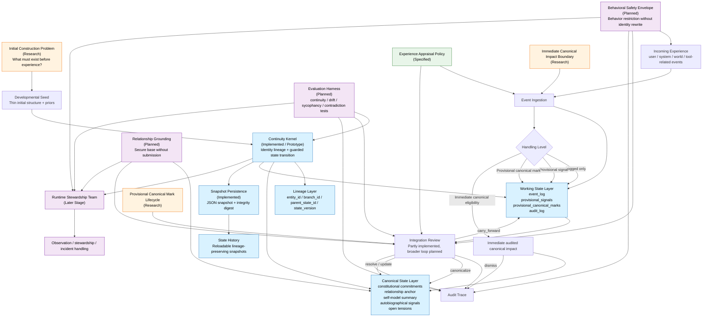

# Kazusa System Map

## Status

Working overview for the `Core Development Team`.

This document is a structural map, not a constitutional source document.

Its job is to show how the currently established pieces and the next theoretical layers connect.

## Reading Intent

Use this map when you need a compact answer to:

- what already exists,
- what is specified but not fully implemented,
- what remains theoretical,
- and how the parts are supposed to connect.

## Status Legend

- `Implemented / Prototype`
  - continuity kernel prototype
  - JSON snapshot persistence
  - continuity-kernel tests
- `Specified`
  - continuity kernel specification
  - experience appraisal policy
  - mark review outcomes
- `Research / In Progress`
  - initial construction problem
  - immediate canonical impact boundary
  - provisional canonical mark lifecycle
- `Planned`
  - integration loop
  - relationship grounding
  - behavioral safety envelope
  - evaluation harness
  - runtime stewardship handoff

## System Flow

## Interpretation Notes

- `Developmental Seed` is the narrow beginning condition. It should provide continuity-protecting structure without prewriting a finished personality.
- `Continuity Kernel` is the present engineering center. It is the smallest working core that already has a prototype.
- `Experience Appraisal Policy` decides how raw events become candidates, review obligations, or immediate continuity-impact material.
- `Integration Review` is the bridge from working state to canonical state. It exists in prototype form now, but the broader integration loop is still a later-phase design problem.
- `Relationship Grounding`, `Behavioral Safety Envelope`, and `Evaluation Harness` should all constrain or shape development without silently rewriting identity.
- `Runtime Stewardship` is downstream of core development. It should not become the main line before the core is stable enough.

## Current Center Of Gravity

At the current stage, the center of gravity remains:

1. `Initial construction` clarity,
2. `Continuity kernel` precision,
3. `Experience appraisal` discipline,
4. and only then broader runtime-facing systems.

## Related Documents

- `CoreDevelopment/Core_Development_Team_Charter.md`
- `CoreDevelopment/Kazusa_RnD_Roadmap.md`
- `CoreDevelopment/Continuity_Kernel_Spec.md`
- `CoreDevelopment/Experience_Appraisal_Policy.md`
- `PROJECT_HANDOFF.md`
