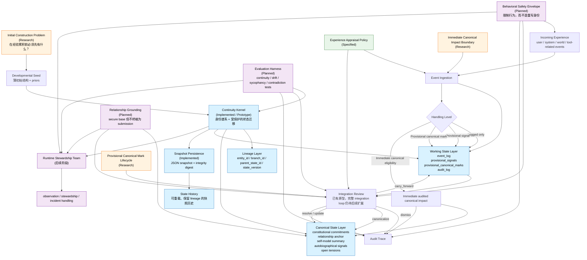

# Kazusa System Map（中文镜像）

## 状态

这是给 `Core Development Team` 使用的工作总览图。

它不是宪法级源文档。

它的作用是把当前已经建立的部分、已写明但未完全实现的部分、以及接下来理论上要落地的部分，用结构关系图串起来。

## 阅读目的

当你需要快速回答下面这些问题时，可以先看这份图：

- 现在已经有什么，
- 哪些已经写成规范但还没完全实现，
- 哪些仍在理论阶段，
- 它们彼此之间怎么连接。

## 状态图例

- `Implemented / Prototype`
  - continuity kernel prototype
  - JSON snapshot persistence
  - continuity-kernel tests
- `Specified`
  - continuity kernel specification
  - experience appraisal policy
  - mark review outcomes
- `Research / In Progress`
  - initial construction problem
  - immediate canonical impact boundary
  - provisional canonical mark lifecycle
- `Planned`
  - integration loop
  - relationship grounding
  - behavioral safety envelope
  - evaluation harness
  - runtime stewardship handoff

## 系统流程图

## 解读说明

- `Developmental Seed` 是最窄的起始条件。它提供保护连续性的结构，但不预写一个完成的人格。
- `Continuity Kernel` 是当前最核心的工程中心，也是现在已经有 prototype 的地方。
- `Experience Appraisal Policy` 负责决定原始事件如何变成候选、复核义务、或即时连续性影响材料。
- `Integration Review` 是从 working state 通往 canonical state 的桥。它现在已有原型，但更完整的 integration loop 仍属于后续阶段。
- `Relationship Grounding`、`Behavioral Safety Envelope`、`Evaluation Harness` 都应当影响发展过程，但不能静默重写身份。
- `Runtime Stewardship` 是核心研发之后的下游部分，在 core 足够稳定之前，不应反过来成为主线。

## 当前重心

当前阶段的重心仍然是：

1. `Initial construction` 的清晰化，
2. `Continuity kernel` 的精确化，
3. `Experience appraisal` 的纪律化，
4. 然后才是更广泛的 runtime-facing 系统。

## 相关文档

- `CoreDevelopment/Core_Development_Team_Charter.md`
- `CoreDevelopment/Kazusa_RnD_Roadmap.md`
- `CoreDevelopment/Continuity_Kernel_Spec.md`
- `CoreDevelopment/Experience_Appraisal_Policy.md`
- `PROJECT_HANDOFF.md`
